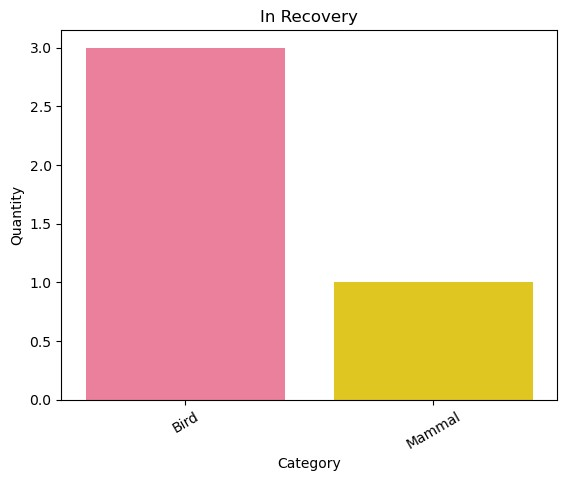

# Biodiversidade em Parques Nacionais Norte Americanos

# 1. Introdução
 
Esse projeto investiga espécies ameaçadas de extinção em 4 parques nacionais dos Estados Unidos da América. É parte integrante do curso de Data Science Foundations, do Codecademy. Os objetivos desse projeto são preparar os dados, realizar análises gráficas e, por fim, explicar os resultados do estudo com base em algumas questões levantadas.

As ferramentas utilizadas foram:

Python 3.0
Jupyter Notebook
Github

O dataset foi disponibilizado pelo Codecademy e provém do National Parks Service.
Nota: Os dados deste projeto são inspirados em dados reais, mas são principalmente fictícios.

# 2. Briefing

Esse projeto tem o objetivo de entender melhor as espécies observadas em cada parque, bem como seu estado de conservação.

Essas são as questões que esse projeto procura responder:

- Qual é a distribuição dos estados de conservação por categoria?
- Qual é a categoria com o maior número de espécies ameaçadas de extinção?
- Qual é o número de observações por parque?
- Dentro categoria mais protegida, qual espécie é mais observada em cada parque?
- Qual espécie é a mais observada em cada parque?

# 3. Resolução
## 3.1. Estrutura dos dados

O conjunto de dados "species.info.csv" contém dados sobre diferentes espécies e seu estado de conservação. Possui 5.824 linhas e 5 colunas. Seus atributos são:

| Atributos |	Descrição |
| --------- | --------- |
| category | categoria da espécie |
| scientific_name | nome científico da espécie |
| common_names | nomes comuns das espécies |
| conservation_status | estado de conservação da espécie |

Os conjunto de dados "observations.csv" mantém registros de avistamentos de diferentes espécies em vários parques nacionais nos últimos 7 dias e traz informações sobre quatro parques nacionais: Great Smoky Mountains National Park, Yosemite National Park, Bryce National Park e Yellowstone National Park. Possui 23.281 linhas e 3 colunas. Seus atributos são:

| Atributos |	Descrição |
| --------- | --------- |
| scientific_name | nome científico da espécie |
| park_name | nome do parque nacional |
| observations | número de observações da espécie |

Algumas alterações foram necessárias nos datasets, como a limpeza de linhas duplicadas, para evitar uma análise enviesada, e o preenchimento de valores nulos.

## 3.2. Visualização de dados e Insights

Para responder às questões do projeto e encontrar insights sobre os dados, gerei gráficos e tabelas que pudessem auxiliar no entendimento dos dados. A escolha do tipo de gráfico se deu em função dos tipos das variáveis envolvidas, e as tabelas foram utilizadas quando entendi que, por meio delas, o entendimento se tornaria mais objetivo.

_1. Distribuição dos estados de conservação por categoria_

Pelo gráfico, observa-se que a categoria "Bird" é a que possui o maior número de espécies no estado de conservação "Species of Concern".

A categoria "Mammal" representa o maior número de espécies em "Endangered".

No estado de conservação "Threatened", a categoria "Fish" se destaca.

E, por fim, em "In Recovery" a categoria "Bird" se destaca.

_2. Número de observações por parque_

Por meio da tabela, vemos que o Yellowstone National Park registrou o maior número de observações nos últimos 7 dias, com 1.442.314 observações.

_3. Espécie mais observada em cada parque dentro da categoria mais protegida_

Primeiramente descobri que a categoria mais protegida é a categoria "Mammal", com 17,05% das espécies sob algum tipo de proteção, seguida da categoria "Bird" com 15,37%.

A tabela acima apresenta o número total de observações da categoria "Mammal" em cada parque, considerando apenas as espécies sob algum tipo de proteção. O Yellowstone National Park apresentou o maior número de avistamentos dessa categoria. É importante observar que isso pode se dever ao fato desse parque também apresentar o maior número de observações de espécies no geral.

A tabela acima apresenta qual espécie, dentro da categoria "Mammal" foi mais avistada em cada parque. Das 4 espécies, 3 são morcegos.

_4. Espécie mais observada em cada parque_

Para responder a essa pergunta, primeiro gerei um gráfico que apresentasse o número de espécies de cada categoria observada em cada parque. Assim, é possível já observar que em todos os 4 parques a categoria mais avistada foi a "Vascular Plant".

A tabela abaixo apresenta, por fim, qual espécie foi mais avistada em cada parque.

# 4. Conclusões

Este projeto foi capaz de fazer algumas visualizações de dados e também conseguiu responder as questões colocadas no início:

**- Qual é a distribuição dos estados de conservação por categoria?**

Em "Espécies de Preocupação" e "Recuperação", os pássaros se destacam.
Em "Ameaçadas", a categoria dos peixes se destaca.
Em "Ameaçados de Extinção", os mamíferos representam o maior número de espécies.

**- Qual é a categoria com o maior número de espécies ameaçadas de extinção?**

Mammal (Mamíferos).

**- Qual é o número de observações por parque?**

Yellowstone National Park: 1.442.314

Yosemite National Park: 862.836

Bryce National Park: 575.901

Great Smoky Mountains National Park: 431.378

**- Dentro categoria mais protegida, qual espécie é mais observada em cada parque?**

A categoria mais protegida é a categoria Mammal (mamíferos).

| Parque |	Espécie | Número de Observações | Estado de conservação
| --------- | --------- | ------ | ----- |
| Great Smoky Mountains National Park | Myotis californicus | 97 | Espécie de Preocupação |
| Yosemite National Park | Myotis yumanensis | 169 | Espécie de Preocupação |
| Bryce National Park | Myotis austroriparius | 152 | Espécie de Preocupação |
| Yellowstone National Park	| Taxidea taxus | 261 | Espécie de Preocupação |

**- Qual espécie é a mais observada em cada parque?**

| Parque |	Espécie | Número de Observações |
| --------- | --------- | ----- |
| Great Smoky Mountains National Park | Sonchus asper ssp. asper	 | 147 |
| Yosemite National Park | Ivesia shockleyi var. shockleyi | 223 |
| Bryce National Park | Valerianella radiata | 176 |
| Yellowstone National Park	| Lycopodium tristachyum | 321 |

# 5. Pesquisas futuras

Após a análise dos dados, alguns questionamentos surgiram e podem ser fruto de pesquisas futuras:

- Qual a situação atual dos morcegos norte-americanos e onde podem ser encontrados?
 
 Segundo o Bat Conservation International, o Myotis californicus é uma espécie de menor preocupação e se estende por todo o oeste da América do Norte, do sul do Alasca ao sul da Guatemala, e é um dos morcegos mais abundantes em habitats de matagais desérticos.

 Já o Myotis yumanensis é também uma espécie de menor preocupação, porém encontra-se ameaçada pela perda de habitats ribeirinhos e pelo declínio das fontes permanentes de água no sudoeste americano. É encontrado em todo o oeste da América do Norte, da Colúmbia Britânica, passando por Washington, Idaho e oeste de Montana, sul do Wyoming, Colorado, Novo México, oeste do Texas e no México. Ocasionalmente empoleirados em minas ou cavernas, esses morcegos são mais frequentemente encontrados em edifícios ou pontes. 

 Os Myotis austroriparius estão localizados em uma faixa larga de Indiana e Illinois ao sul ao longo do rio Mississippi e ao redor da planície costeira do sudeste até a Carolina do Norte. Esses morcegos também são relatados no sudeste da Virgínia. Algumas populações parecem estar em declínio constante e este morcego é considerado uma espécie de preocupação pelo Serviço de Pesca e Vida Selvagem dos EUA.

- Qual a situação do texugo americano? (Taxidea taxus)

Os texugos são encontrados principalmente na região das Grandes Planícies da América do Norte. Ocorrem ao norte, através das províncias do centro-oeste do Canadá, em habitats apropriados em todo o oeste dos Estados Unidos, e ao sul, nas áreas montanhosas do México. Eles expandiram seu alcance desde a virada do século 20 e agora são encontrados no extremo leste de Ontário, Canadá. 

As principais ameaças que os texugos americanos enfrentam em toda a sua área de distribuição são atropelamentos e declínio do habitat.Os texugos americanos em Ontário e na Colúmbia Britânica são atualmente considerados ameaçados de extinção pela COSEWIC (Committee on the Status of Endangered Wildlife in Canada).

Outras análises que podem ser frutos de próximos estudos são:

A) A identificação da espécie mais ameaçada de extinção do dataset e em quais parques ela é observada.
B) Um estudo mais aprofundado da categoria dos peixes e das aves, buscando encontrar quais são as espécies que podem ser encontradas nos parques e o que fazer para protegê-las.

Ainda, seria interessante manter um acompanhamento contínuo das espécies mais avistadas em cada parque de modo a conhecer a evolução das suas populações ao longo do tempo e evitar que entrem em algum tipo de ameaça.

# 6. Referências

BAT CONSERVATION INTERNATIONAL. Acessado em 24 de outubro de 2023 em: (https://www.batcon.org/about-bats/bat-profiles/).

COSEWIC. 2012. COSEWIC assessment and status report on the American Badger Taxidea taxus in Canada. Committee on the Status of Endangered Wildlife in Canada. Ottawa. iv + 63 pp. (www.registrelep-sararegistry.gc.ca/default_e.cfm).

SHEFFERLEY, N. 1999. "Taxidea taxus" (On-line), Animal Diversity Web. Acessado em 24 de outubro de 2023 em https://animaldiversity.org/accounts/Taxidea_taxus/